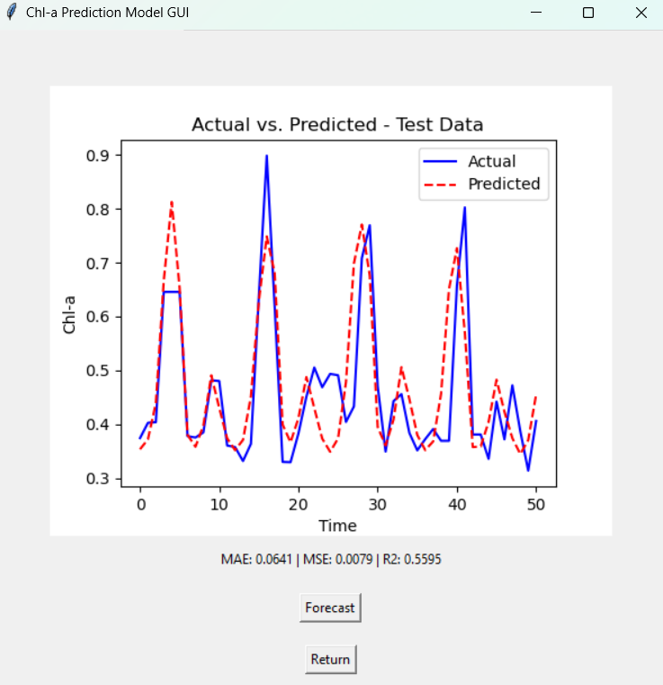
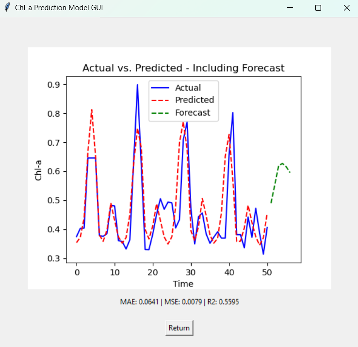

# Chlorophyll-a (Chl-a) Prediction and Forecasting GUI

## Important Note:
This GUI is a general-purpose tool for predicting and forecasting Chlorophyll-a (Chl-a) concentrations. **Please note that this tool was NOT used to generate the results for our study**, although it contains the same models and is intended for general application.

  
  

## General Information:
This tool provides a selection of univariate time series models to predict and forecast Chl-a concentrations. The included models are:

- **KAN** (Kolmogorov-Arnold Networks)
- **MLP-NN** (Multilayer Perceptron Neural Network)
- **LSTM** (Long Short-Term Memory)
- **GRU** (Gated Recurrent Units)
- **RF** (Random Forest)
- **GPR** (Gaussian Process Regressor)
- **SVR** (Support Vector Regressor)

### Features:
- **Lag Features:** 12 lag features are automatically generated, based on the monthly frequency of the original Chl-a dataset. If your dataset has a different frequency, you can modify the lag duration in the code.
- **Forecast Duration:** The default forecast duration is set to 6, which corresponds to forecasting the next six months in the original dataset. If your data uses a different frequency, you are encouraged to modify the forecast duration accordingly in the code.

After selecting a model, the tool will train it using your dataset, and it will display a plot of actual vs. predicted values. Key metrics such as **MAE**, **MSE**, and **R²** will also be provided. You can then use the trained model to forecast future values.

## Caution:
Since this tool is designed for general use, performance may vary depending on your dataset. For optimal results, consider fine-tuning the hyperparameters specific to your data.

## Required Libraries:
The following libraries are necessary to run the tool. These can be installed via standard package managers (e.g., `pip`) and are not custom or local libraries.

- `tkinter`
- `pandas`
- `matplotlib`
- `sklearn`
- `numpy`
- `statsmodels`
- `torch`
- `KAN`
- `tqdm`
- `tensorflow`
- `deepkan`
- `scipy`
- `RandomForestRegressor`
- `GaussianProcessRegressor`
- `SVR`

## How to Use:
1. Ensure all required libraries are installed.
2. Load your Chl-a dataset into the tool.
3. Select a model, train it, and review the performance metrics.
4. Forecast future values based on your trained model.
